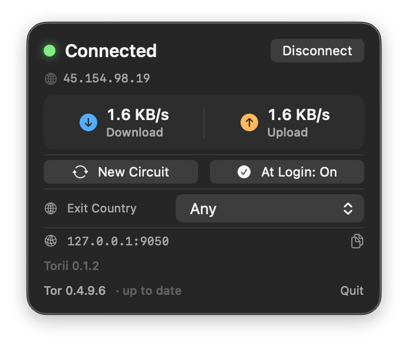
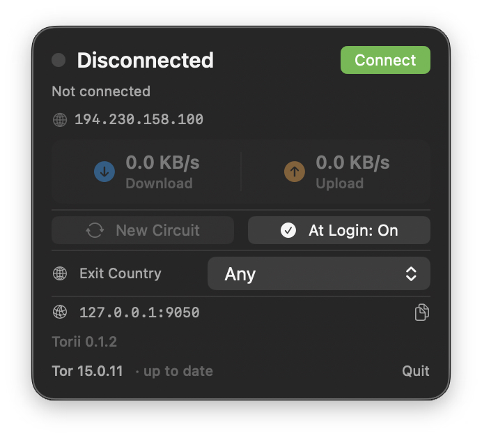

# Torii

A minimal macOS menu bar app that connects your Mac to the Tor network with one click.

  

---

## Screenshots

| Connected | Disconnected |
|---|---|
|  |  |

## Features

- **One-click connect / disconnect** — starts and stops the bundled Tor process
- **System-wide SOCKS proxy** — automatically configures macOS network settings to route traffic through `127.0.0.1:9050`
- **Live status** — bootstrap progress, exit node (IP, country flag, relay nickname)
- **Bandwidth monitor** — real-time download/upload speeds
- **Exit country picker** — request a specific country for the exit relay
- **Auto-update check** — compares the bundled Tor version against the Tor Project release index
- **Login item** — optional launch at login via `SMAppService`

## Requirements

| | |
|---|---|
| macOS | 13 Ventura or later |
| Architecture | Apple Silicon (aarch64) |
| Xcode | 16+ |
| [XcodeGen](https://github.com/yonaskolb/XcodeGen) | to regenerate the `.xcodeproj` |

## Project structure

```
torii/
├── Torii/                   # Xcode project (source code)
│   ├── project.yml          # XcodeGen spec
│   └── Torii/
│       ├── ToriiApp.swift
│       ├── Models/          # Data types (TorModels.swift)
│       ├── Tor/             # TorManager, TorControlSocket, TorParser
│       ├── Updates/         # UpdateChecker
│       ├── ViewModels/      # TorViewModel (ObservableObject)
│       └── Views/           # SwiftUI views
├── tor-expert-bundle/       # Tor 15.0.11 binaries (aarch64)
│   ├── tor/                 # tor daemon + libevent dylib + pluggable transports
│   └── data/                # geoip / geoip6 databases
└── assets/                  # App icon exports (PNG + ICNS)
```

## Build

1. Clone the repo.
2. Install XcodeGen if needed:
   ```sh
   brew install xcodegen
   ```
3. Generate the Xcode project:
   ```sh
   cd Torii
   xcodegen generate
   ```
4. Open `Torii.xcodeproj` in Xcode and run the **Torii** scheme.

The build phase automatically copies the Tor binaries from `tor-expert-bundle/` into the app bundle, strips quarantine attributes, and ad-hoc signs each binary.

## How traffic is routed

When Torii is connected, **all network traffic on your Mac is routed through the Tor network** via a system-wide SOCKS5 proxy.

```
Your Mac (any app)
       │
       ▼  SOCKS5  127.0.0.1:9050
  ┌─────────────┐
  │  tor daemon │  (bundled, runs locally)
  └─────────────┘
       │
       ▼  encrypted, onion-layered
  ┌──────────────┐    ┌──────────────┐    ┌──────────────┐
  │  Guard relay │───▶│ Middle relay │───▶│  Exit relay  │
  └──────────────┘    └──────────────┘    └──────────────┘
                                                 │
                                                 ▼
                                           Internet
```

Each hop only knows its immediate neighbours — the exit relay sees the destination but not your real IP.

Torii configures the proxy via `networksetup` on connect and removes it on disconnect. The IP displayed in the menu bar is fetched **through the SOCKS proxy** when connected, so it always matches the exit relay's public IP as seen by the outside world.

## How it works

| Component | Role |
|---|---|
| `TorManager` | Spawns the `tor` process, writes `torrc`, manages the system proxy via `networksetup` |
| `TorControlSocket` | Raw TCP client for the Tor control protocol (port 9051) |
| `TorParser` | Parses bootstrap progress and relay descriptors from control events |
| `TorViewModel` | `@MainActor` coordinator — drives the UI and owns the connect/disconnect lifecycle |
| `UpdateChecker` | Scrapes the Tor Project release index and compares version strings |

## Privacy

Torii does not collect or transmit any data. All network traffic goes through Tor. The update checker makes a single HTTP request to `https://dist.torproject.org/torbrowser/` to compare version numbers.

## License

MIT
